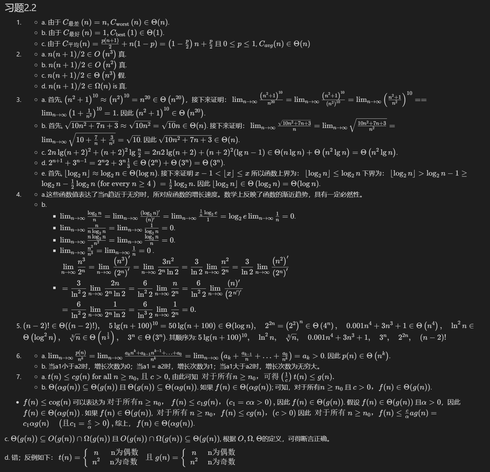
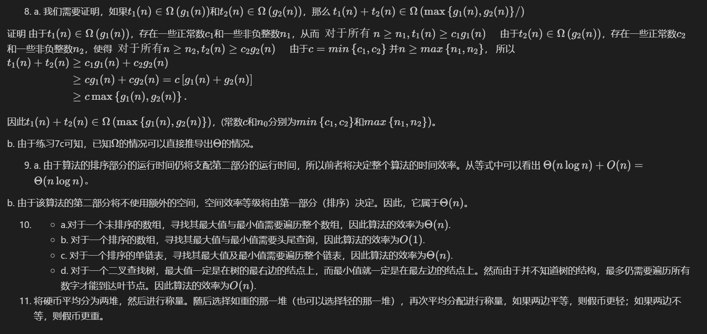

第2章 算法效率分析基础

---
## 习题2.2

1. 
   - a. 由于 $C_{\text {最差 }}(n)=n, C_{\text {worst }}(n) \in \Theta(n)$.
   - b. 由于 $C_{\text {最好 }}(n)=1, C_{\text {best }}(1) \in \Theta(1)$.
   - c. 由于 $C_{平均}(n)=\frac{p(n+1)}{2}+n(1-p)=\left(1-\frac{p}{2}\right) n+\frac{p}{2}$ 且 $0 \leq p \leq 1$, $C_{a v g}(n) \in \Theta(n)$
2. 
   - a. $n(n+1) / 2 \in O\left(n^3\right)$ 真.
   - b. $n(n+1) / 2 \in O\left(n^2\right)$ 真.
   - c. $n(n+1) / 2 \in \Theta\left(n^3\right)$ 假.
   - d. $n(n+1) / 2 \in \Omega(n)$ is 真.
  
3. 
   - a. 首先, $\left(n^2+1\right)^{10} \approx\left(n^2\right)^{10}=n^{20} \in \Theta\left(n^{20}\right)$，接下来证明：
    $
    \lim _{n \rightarrow \infty} \frac{\left(n^2+1\right)^{10}}{n^{20}}=\lim _{n \rightarrow \infty} \frac{\left(n^2+1\right)^{10}}{\left(n^2\right)^{10}}=\lim _{n \rightarrow \infty}\left(\frac{n^2+1}{n^2}\right)^{10}==\lim _{n \rightarrow \infty}\left(1+\frac{1}{n^2}\right)^{10}=1 .
    $
因此 $\left(n^2+1\right)^{10} \in \Theta\left(n^{20}\right)$.
   - b. 首先, $\sqrt{10 n^2+7 n+3} \approx \sqrt{10 n^2}=\sqrt{10} n \in \Theta(n)$. 接下来证明： $\lim _{n \rightarrow \infty} \frac{\sqrt{10 n^2+7 n+3}}{n}=\lim _{n \rightarrow \infty} \sqrt{\frac{10 n^2+7 n+3}{n^2}}=\lim _{n \rightarrow \infty} \sqrt{10+\frac{7}{n}+\frac{3}{n^2}}=\sqrt{10}$. 因此 $\sqrt{10 n^2+7 n+3} \in \Theta(n)$.
   - c. $2 n \lg (n+2)^2+(n+2)^2 \lg \frac{n}{2}=2 n 2 \lg (n+2)+(n+2)^2(\lg n-1) \in$ $\Theta(n \lg n)+\Theta\left(n^2 \lg n\right)=\Theta\left(n^2 \lg n\right)$.
   - d. $2^{n+1}+3^{n-1}=2^n 2+3^n \frac{1}{3} \in \Theta\left(2^n\right)+\Theta\left(3^n\right)=\Theta\left(3^n\right)$.
   - e. 首先, $\left\lfloor\log _2 n\right\rfloor \approx \log _2 n \in \Theta(\log n)$. 接下来证明 $x-1<\lfloor x\rfloor \leq x$ 所以函数上界为：
    $
    \left\lfloor\log _2 n\right\rfloor \leq \log _2 n
    $
    下界为：
    $
    \left\lfloor\log _2 n\right\rfloor>\log _2 n-1 \geq \log _2 n-\frac{1}{2} \log _2 n \text { (for every } n \geq 4 \text { ) }=\frac{1}{2} \log _2 n .
    $
    因此 $\left\lfloor\log _2 n\right\rfloor \in \Theta\left(\log _2 n\right)=\Theta(\log n)$.

4. 
   - a.这些函数值表达了当n趋近于无穷时，所对应函数的增长速度。数学上反映了函数的渐近趋势，具有一定必然性。
   - b. 
     - $\lim _{n \rightarrow \infty} \frac{\log _2 n}{n}=\lim _{n \rightarrow \infty} \frac{\left(\log _2 n\right)^{\prime}}{(n)^{\prime}}=\lim _{n \rightarrow \infty} \frac{\frac{1}{n} \log _2 e}{1}=\log _2 e \lim _{n \rightarrow \infty} \frac{1}{n}=0$. 
     - $\lim _{n \rightarrow \infty} \frac{n}{n \log _2 n}=\lim _{n \rightarrow \infty} \frac{1}{\log _2 n}=0$.
     - $\lim _{n \rightarrow \infty} \frac{n \log _2 n}{n^2}=\lim _{n \rightarrow \infty} \frac{\log _2 n}{n}=0$.
     - $\lim _{n \rightarrow \infty} \frac{n^2}{n^3}=\lim _{n \rightarrow \infty} \frac{1}{n}=0$  .
     - $\begin{aligned}&\lim _{n \rightarrow \infty} \frac{n^3}{2^n}=\lim _{n \rightarrow \infty} \frac{\left(n^3\right)^{\prime}}{\left(2^n\right)^{\prime}}=\lim _{n \rightarrow \infty} \frac{3 n^2}{2^n \ln 2}=\frac{3}{\ln 2} \lim _{n \rightarrow \infty} \frac{n^2}{2^n}=\frac{3}{\ln 2} \lim _{n \rightarrow \infty} \frac{\left(n^2\right)^{\prime}}{\left(2^n\right)^{\prime}} \\&=\frac{3}{\ln ^2 2} \lim _{n \rightarrow \infty} \frac{2 n}{2^n \ln 2}=\frac{6}{\ln ^2 2} \lim _{n \rightarrow \infty} \frac{n}{2^n}=\frac{6}{\ln ^2 2} \lim _{n \rightarrow \infty} \frac{(n)^{\prime}}{\left(2^{\left.n^{\prime}\right)^{\prime}}\right.} \\&=\frac{6}{\ln ^2 2} \lim _{n \rightarrow \infty} \frac{1}{2^n \ln 2}=\frac{6}{\ln ^3 2} \lim _{n \rightarrow \infty} \frac{1}{2^n}=0 .\end{aligned}$

5. $(n-2) ! \in \Theta((n-2) !), \quad 5 \lg (n+100)^{10}=50 \lg (n+100) \in \Theta(\log n), \quad 2^{2 n}=$ $\left(2^2\right)^n \in \Theta\left(4^n\right), \quad 0.001 n^4+3 n^3+1 \in \Theta\left(n^4\right), \quad \ln ^2 n \in \Theta\left(\log ^2 n\right), \quad \sqrt[3]{n} \in$ $\Theta\left(n^{\frac{1}{3}}\right), \quad 3^n \in \Theta\left(3^n\right)$. 其顺序为:
$
5 \lg (n+100)^{10}, \quad \ln ^2 n, \quad \sqrt[3]{n}, \quad 0.001 n^4+3 n^3+1, \quad 3^n, \quad 2^{2 n}, \quad(n-2) !
$

6. - a. $\lim _{n \rightarrow \infty} \frac{p(n)}{n^k}=\lim _{n \rightarrow \infty} \frac{a_k n^k+a_{k-1} n^{k-1}+\ldots+a_0}{n^k}=\lim _{n \rightarrow \infty}\left(a_k+\frac{a_{k-1}}{n}+\ldots+\frac{a_0}{n^k}\right)$ $=a_k>0$.
因此 $p(n) \in \Theta\left(n^k\right)$.
   - b. 当a1小于a2时，增长次数为0；当a1 = a2时，增长次数为1；当a1大于a2时，增长次数为无穷大。

7. - a. $t(n) \leq c g(n) \text { for all } n \geq n_0 \text {, 且 } c>0,$ 由此可知
   $
   \text { 对于所有} n \geq n_0，可得\left(\frac{1}{c}\right) t(n) \leq g(n)  .
   $
   - b. $\Theta(\alpha g(n)) \subseteq \Theta(g(n))$ 且 $\Theta(g(n)) \subseteq \Theta(\alpha g(n))$. 如果 $f(n) \in \Theta(\alpha g(n))$; 可知，对于所有$n \geq n_0$ 且 $c>0，f(n) \in \Theta(g(n))$.
 - 
   $f(n) \leq \operatorname{cog}(n)$ 
   可以表达为
   $
   对于所有n \geq n_0 ， \left.f(n) \leq c_1 g(n)，(c_1=c \alpha>0\right),
   $
   因此 $f(n) \in \Theta(g(n))$.
   假设 $f(n) \in \Theta(g(n))$ 且$\alpha>0$，因此 $f(n) \in \Theta(\alpha g(n))$ . 
   如果 $f(n) \in \Theta(g(n))$,
   $
   \text { 对于所有 } n \geq n_0，f(n) \leq c g(n)， (c>0)
   $
   因此
   $
   \text { 对于所有 } n \geq n_0，f(n) \leq \frac{c}{\alpha} a g(n)=c_1 \alpha g(n) \quad \left(\text {且} c_1=\frac{c}{\alpha}>0\right),
   $
   综上， $f(n) \in \Theta(\alpha g(n))$.

c.  $\Theta(g(n)) \subseteq O(g(n)) \cap \Omega(g(n))$ 且 $O(g(n)) \cap \Omega(g(n)) \subseteq \Theta(g(n))$, 根据 $O, \Omega$, $\Theta$的定义，可得断言正确。

d. 错；反例如下：
$
t(n)=\left\{\begin{array}{cc}
n & \text { n为偶数} \\
n^2 & \text { n为奇数 }
\end{array} \text { 且 } g(n)=\left\{\begin{array}{cl}
n & \text { n为偶数} \\
n^2 & \text { n为奇数 }
\end{array}\right.\right.
$

8. a. 我们需要证明，如果$t_1(n)\in \Omega\left(g_1(n)\right)$和$t_2(n)\in \Omega\left(g_2(n)\right)$，那么
$t_1(n)+t_2(n)\in \Omega\left(\max \left \{g_1(n), g_2(n)\} \right/ \right)$

证明 由于$t_1(n) \in \Omega\left(g_1(n)\right)$，存在一些正常数$c_1$和一些非负整数$n_1$，从而
$
\text { 对于所有 } n \geq n_1 , t_1(n)\geq c_1 g_1(n) \quad
$
由于$t_2(n)\in \Omega\left(g_2(n)\right)$，存在一些正常数$c_2$和一些非负整数$n_2$，使得
$
\text { 对于所有} n \geq n_2 , t_2(n) \geq c_2 g_2(n) \quad 
$
由于$c=min\left\{c_1, c_2\right\}$ 并$n\geq max\left\{n_1, n_2\right\}$， 所以
$
\begin{aligned}
t_1(n)+t_2(n) & \geq c_1 g_1(n)+c_2 g_2(n) \\
& \geq c g_1(n)+c g_2(n)=c\left[g_1(n)+g_2(n)\right] \\
& \geq c \max \left\{g_1(n), g_2(n)\right\} .
\end{aligned}
$

因此$t_1(n)+t_2(n) \in \Omega\left(\max \left\{g_1(n), g_2(n)\right\}\right)$，(常数$c$和$n_0$分别为$min\left\{c_1, c_2\right\}$和$max\left\{n_1, n_2\right\})$。

b. 由于练习7c可知，已知$\Omega$的情况可以直接推导出$\Theta$的情况。

9. a. 由于算法的排序部分的运行时间仍将支配第二部分的运行时间，所以前者将决定整个算法的时间效率。从等式中可以看出
$
\Theta(n\log n)+O(n)=\Theta(n\log n)。
$

b. 由于该算法的第二部分将不使用额外的空间，空间效率等级将由第一部分（排序）决定。因此，它属于$\Theta(n)$。

10. - a.对于一个未排序的数组，寻找其最大值与最小值需要遍历整个数组，因此算法的效率为$\Theta(n)$.
    - b. 对于一个排序的数组，寻找其最大值与最小值需要头尾查询，因此算法的效率为$O(1)$.
    - c. 对于一个排序的单链表，寻找其最大值及最小值需要遍历整个链表，因此算法的效率为$\Theta(n)$.
    - d. 对于一个二叉查找树，最大值一定是在树的最右边的结点上，而最小值就一定是在最左边的结点上。然而由于并不知道树的结构，最多仍需要遍历所有数字才能到达叶节点。因此算法的效率为$O(n)$.

11. 将硬币平均分为两堆，然后进行称量。随后选择如重的那一堆（也可以选择轻的那一堆），再次平均分配进行称量，如果两边平等，则假币更轻；如果两边不等，则假币更重。