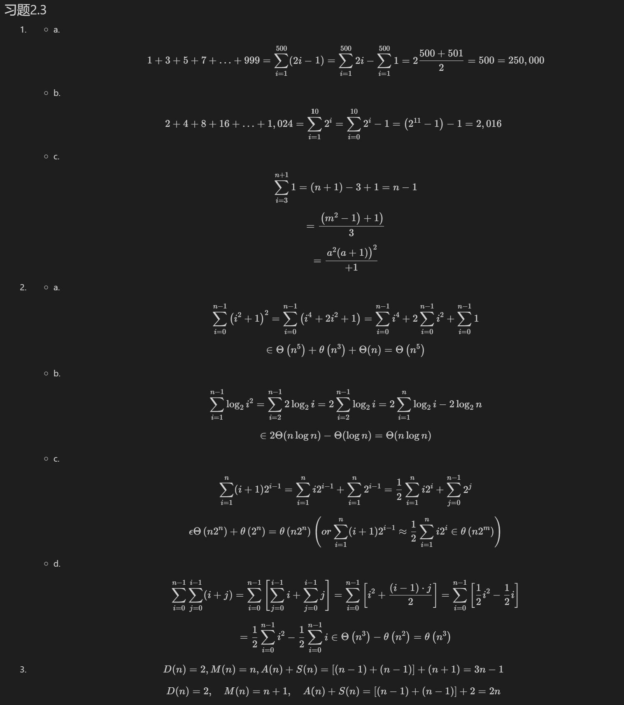
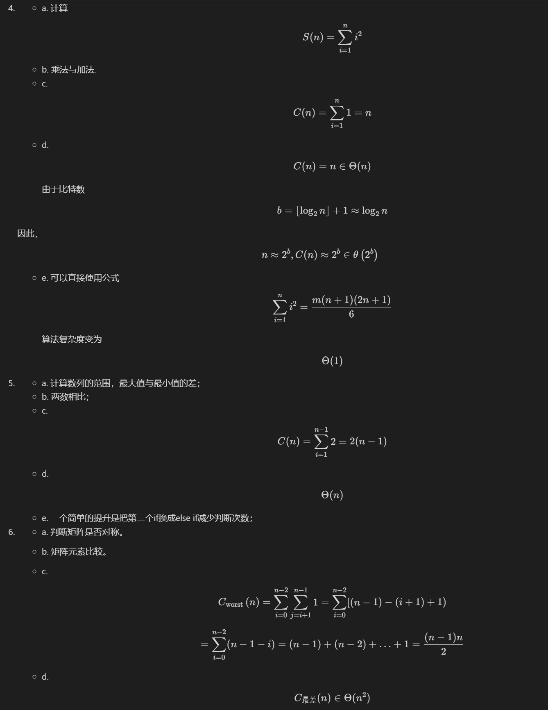
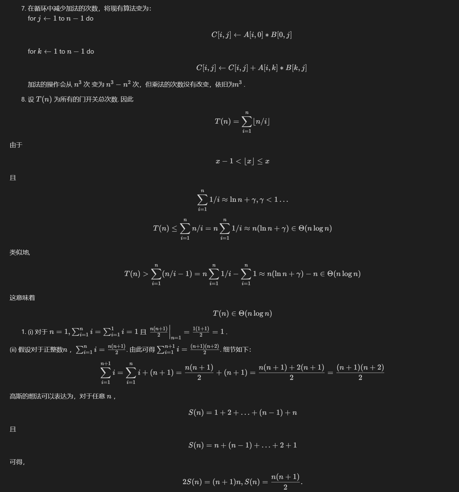
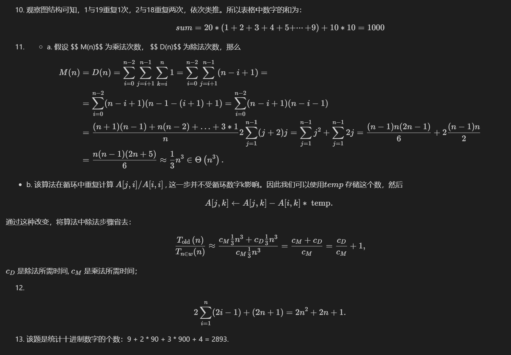

第2章 算法效率分析基础

---
## 习题2.3

1. - a. 
      $$ 
      1+3+5+7+\ldots+999=\sum_{i=1}^{500}(2 i-1)=\sum_{i=1}^{500} 2 i-\sum_{i=1}^{500} 1=2 \frac{500+501}{2}=500=250,000
      $$
   - b. 
    $$
      2+4+8+16+\ldots+1,024=\sum_{i=1}^{10} 2^i=\sum_{i=0}^{10} 2^i-1=\left(2^{11}-1\right)-1=2,016
      $$ 
   - c. 
      $$
       \sum_{i=3}^{n+1} 1=(n+1)-3+1=n-1
       $$
      $$ =\frac{\left.\left(m^2-1\right)+1\right)}{3}$$
      $$ =\frac{\left.a^2(a+1)\right)^2}{+1}$$
2. - a. 
      $$ \sum_{i=0}^{n-1}\left(i^2+1\right)^2=\sum_{i=0}^{n-1}\left(i^4+2 i^2+1\right)=\sum_{i=0}^{n-1} i^4+2 \sum_{i=0}^{n-1} i^2+\sum_{i=0}^{n-1} 1 $$ 
      $$ \in \Theta\left(n^5\right)+\theta\left(n^3\right)+\Theta(n)=\Theta\left(n^5\right)$$  

   - b. 
      $$ \sum_{i=1}^{n-1} \log _2 i^2=\sum_{i=2}^{n-1} 2 \log _2 i=2 \sum_{i=2}^{n-1} \log _2 i=2 \sum_{i=1}^n \log _2 i-2 \log _2 n
      $$

      $$ \in 2 \Theta(n \log n)-\Theta(\log n)=\Theta(n \log n)
      $$ 
   - c. 
      $$ \sum_{i=1}^n(i+1) 2^{i-1}=\sum_{i=1}^n i 2^{i-1}+\sum_{i=1}^n 2^{i-1}=\frac{1}{2} \sum_{i=1}^n i 2^i+\sum_{j=0}^{n-1} 2^j
      $$ 
      $$ \epsilon \Theta\left(n 2^n\right)+\theta\left(2^n\right)=\theta\left(n 2^n\right)\left(o r \sum_{i=1}^n(i+1) 2^{i-1} \approx \frac{1}{2} \sum_{i=1}^n i 2^i \in \theta\left(n 2^m\right)\right)
      $$
   - d. 
     $$ \sum_{i=0}^{n-1} \sum_{j=0}^{i-1}(i+j)=\sum_{i=0}^{n-1}\left[\sum_{j=0}^{i-1} i+\sum_{j=0}^{i-1} j\right]=\sum_{i=0}^{n-1}\left[i^2+\frac{(i-1) \cdot j}{2}\right]=\sum_{i=0}^{n-1}\left[\frac{1}{2} i^2-\frac{1}{2} i\right]
     $$ 
      $$ =\frac{1}{2} \sum_{i=0}^{n-1} i^2-\frac{1}{2} \sum_{i=0}^{n-1} i \in \Theta\left(n^3\right)-\theta\left(n^2\right)=\theta\left(n^3\right)
      $$

3.  
   $$
    D(n)=2, M(n)=n, A(n)+S(n)=[(n-1)+(n-1)]+(n+1)=3 n-1
    $$ 
   $$
    D(n)=2, \quad M(n)=n+1, \quad A(n)+S(n)= [(n-1)+(n-1)]+2=2 n
    $$

4. - a. 计算
      $$
         S(n)=\sum_{i=1}^n i^2 $$
   - b. 乘法与加法.
   - c. 
      $$
          C(n)=\sum_{i=1}^n 1=n 
         $$ 
   - d. 
      $$ C(n)=n \in \Theta(n)
      $$
      由于比特数 
      $$ b=\left\lfloor\log _2 n\right\rfloor+1 \approx \log _2 n
         $$ 
   因此，
      $$
      n \approx 2^b, C(n) \approx 2^b \in \theta\left(2^b\right)$$
   - e. 可以直接使用公式 
      $$
      \sum_{i=1}^n i^2=\frac{m(n+1)(2 n+1)}{6}
      $$
      算法复杂度变为 
      $$ \Theta(1)$$ 
      

5. - a. 计算数列的范围，最大值与最小值的差；
   - b. 两数相比；
   - c. 
      $$
         C(n)=\sum_{i=1}^{n-1} 2=2(n-1)$$ 
   - d. 
      $$ \Theta(n)$$ 
   - e. 一个简单的提升是把第二个if换成else if减少判断次数；

6. - a. 判断矩阵是否对称。
   - b. 矩阵元素比较。
   - c. 
      $$
       C_{\text {worst }}(n)=\sum_{i=0}^{n-2} \sum_{j=i+1}^{n-1} 1=\sum_{i=0}^{n-2}[(n-1)-(i+1)+1)$$ 
      $$
      =\sum_{i=0}^{n-2}(n-1-i)=(n-1)+(n-2)+\ldots+1=\frac{(n-1) n}{2}$$ 
   - d. 
      $$
      C_{\text {最差}}(n) \in \Theta(n^2)
      $$
         
      $$
   C(n) \in O\left(n^2\right)
      $$ 
   - e. 该算法已然最优。因为所有算法比较遍历所有元素，并比较 $$ (n-1) n / 2$$  次，才能发现最终解。

7. 在循环中减少加法的次数，将现有算法变为：\
   for $j \leftarrow 1$  to $n-1$  do 
   $$ C[i, j] \leftarrow A[i, 0] * B[0, j]$$  
   for $k \leftarrow 1$  to $n-1$  do 
   $$  C[i, j] \leftarrow C[i, j]+A[i, k] * B[k, j] $$ 

   加法的操作会从 $n^3$  次 变为 $n^3-n^2$ 次，但乘法的次数没有改变，依旧为$n^3$ . 

8. 设 $T(n)$ 为所有的门开关总次数. 因此
 $$ T(n)=\sum_{i=1}^n\lfloor n / i\rfloor$$ 
   由于 
   $$
      x-1<\lfloor x\rfloor \leq x
   $$  
   且 
   $$ \sum_{i=1}^n 1 / i \approx \ln n+\gamma, \gamma<1 \ldots
   $$ 

   $$ 
   T(n) \leq \sum_{i=1}^n n / i=n \sum_{i=1}^n 1 / i \approx n(\ln n+\gamma) \in \Theta(n \log n)
   $$ 

   类似地,
   $$ 
   T(n)>\sum_{i=1}^n(n / i-1)=n \sum_{i=1}^n 1 / i-\sum_{i=1}^n 1 \approx n(\ln n+\gamma)-n \in \Theta(n \log n)
   $$ 

   这意味着 
   $$
   T(n) \in \Theta(n \log n)
   $$

1. (i) 对于 $n=1, \sum_{i=1}^n i=\sum_{i=1}^1 i=1$  且 $\left.\frac{n(n+1)}{2}\right|_{n=1}=\frac{1(1+1)}{2}=1$ .

(ii) 假设对于正整数$n$ ，$\sum_{i=1}^n i=\frac{n(n+1)}{2}$.
由此可得 $\sum_{i=1}^{n+1} i=\frac{(n+1)(n+2)}{2}$. 细节如下：
$$
\sum_{i=1}^{n+1} i=\sum_{i=1}^n i+(n+1)=\frac{n(n+1)}{2}+(n+1)=\frac{n(n+1)+2(n+1)}{2}=\frac{(n+1)(n+2)}{2}$$

高斯的想法可以表达为，对于任意 $n$  ，
$$ 
S(n)=1+2+\ldots+(n-1)+n
$$ 
且
$$ 
S(n)=n+(n-1)+\ldots+2+1
$$ 
可得，
$$ 
2 S(n)=(n+1) n,  S(n)=\frac{n(n+1)}{2} .
$$ 

10. 观察图结构可知，1与19重复1次，2与18重复两次，依次类推。所以表格中数字的和为：
    $$ sum = 20 * (1 + 2 + 3 + 4 + 5 + ···+ 9) + 10 * 10 = 1000$$  

11.  - a. 假设 $$ M(n)$$ 为乘法次数， $$ D(n)$$  为除法次数，那么
   $$ 
   \begin{aligned}
   M(n) &=D(n)=\sum_{i=0}^{n-2} \sum_{j=i+1}^{n-1} \sum_{k=i}^n 1=\sum_{i=0}^{n-2} \sum_{j=i+1}^{n-1}(n-i+1)=\\
   &=\sum_{i=0}^{n-2}(n-i+1)(n-1-(i+1)+1)=\sum_{i=0}^{n-2}(n-i+1)(n-i-1) \\
   &=\frac{(n+1)(n-1)+n(n-2)+\ldots+3 * 1}{n} 2 \sum_{j=1}^{n-1}(j+2) j=\sum_{j=1}^{n-1} j^2+\sum_{j=1}^{n-1} 2 j=\frac{(n-1) n(2 n-1)}{6}+2 \frac{(n-1) n}{2} \\
   &=\frac{n(n-1)(2 n+5)}{6} \approx \frac{1}{3} n^3 \in \Theta\left(n^3\right) .
   \end{aligned}
   $$ 

   - b. 该算法在循环中重复计算 $A[j, i] / A[i, i]$ , 这一步并不受循环数字k影响。因此我们可以使用$temp$ 存储这个数，然后
   $$ 
   A[j, k] \leftarrow A[j, k]-A[i, k] * \text { temp. }
   $$ 
   通过这种改变，将算法中除法步骤省去：
   $$ 
   \frac{T_{\text {old }}(n)}{T_{n \in w}(n)} \approx \frac{c_M \frac{1}{3} n^3+c_D \frac{1}{3} n^3}{c_M \frac{1}{3} n^3}=\frac{c_M+c_D}{c_M}=\frac{c_D}{c_M}+1,
   $$ 
   $c_D$  是除法所需时间, $c_M$  是乘法所需时间；

12. 
$$ 
2 \sum_{i=1}^n(2 i-1)+(2 n+1)=2 n^2+2 n+1 .
$$ 

13. 该题是统计十进制数字的个数：9 + 2 * 90 + 3 * 900 + 4 = 2893.

