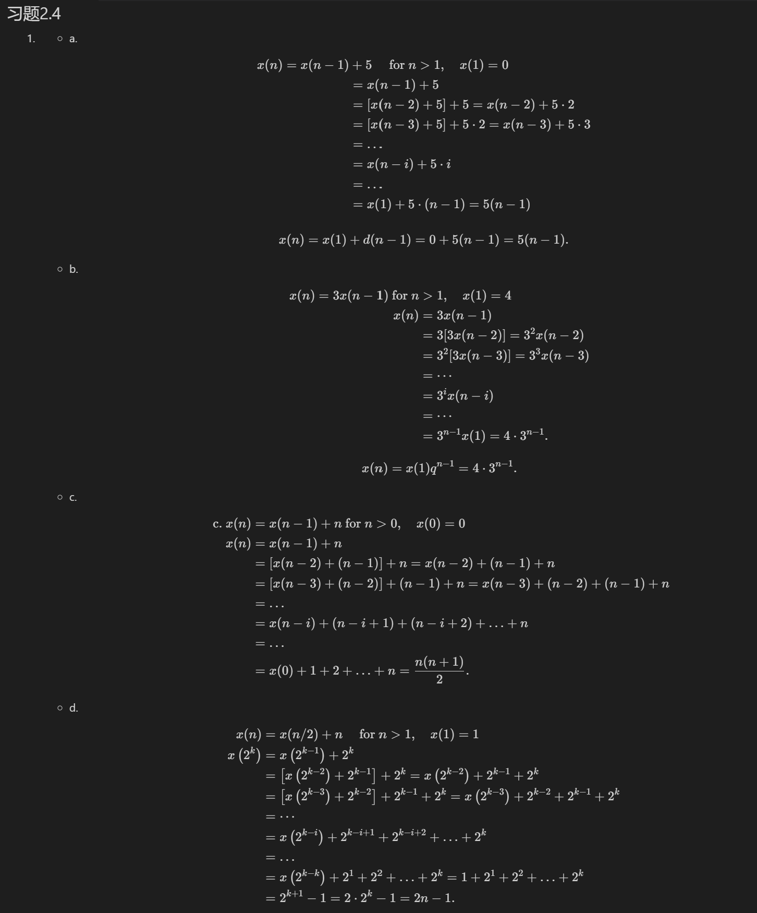
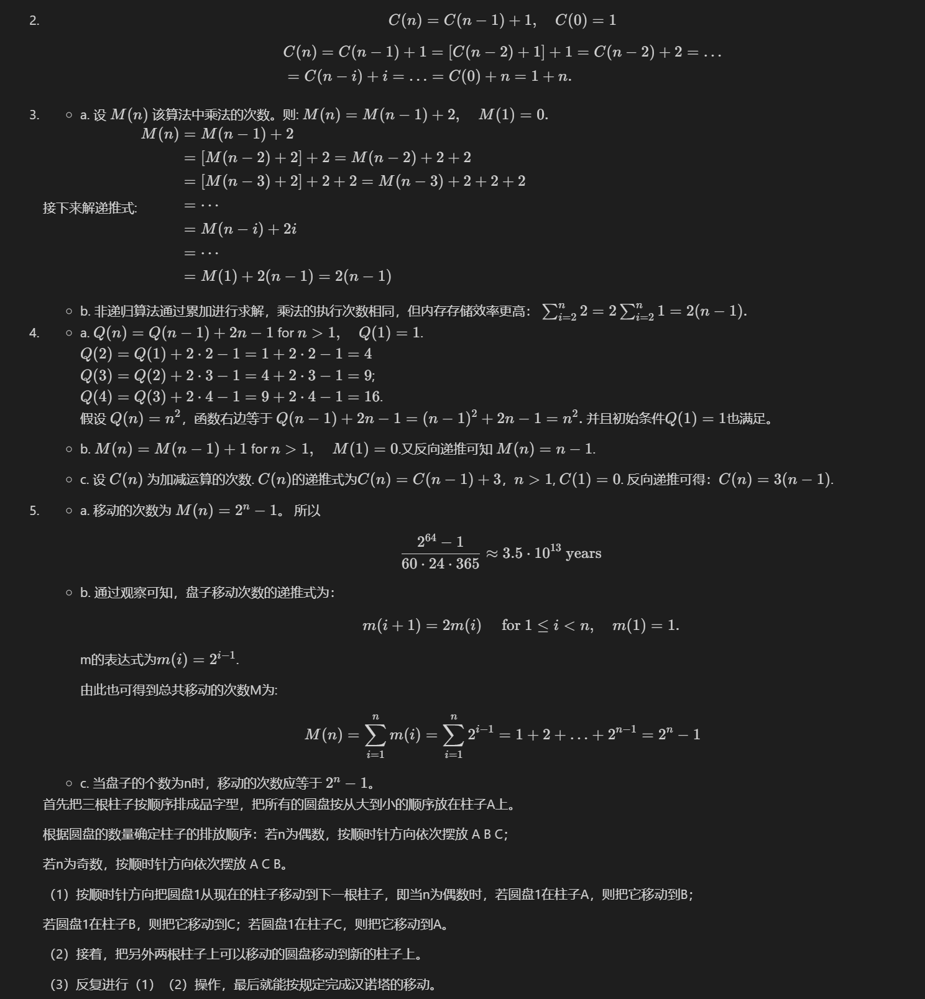

第2章 算法效率分析基础

---
## 习题2.4

1. - a. 
   $$
      \begin{aligned}
      &\text {} \begin{aligned}
      x(n)=x(n-1) &+5 \quad \text { for } n>1, \quad x(1)=0 \\
      &=x(n-1)+5 \\
      &=[x(n-2)+5]+5=x(n-2)+5 \cdot 2 \\
      &=[x(n-3)+5]+5 \cdot 2=x(n-3)+5 \cdot 3 \\
      &=\ldots \\
      &=x(n-i)+5 \cdot i \\
      &=\ldots \\
      &=x(1)+5 \cdot(n-1)=5(n-1)
      \end{aligned}
      \end{aligned}
      $$
      
      $$
      x(n)=x(1)+d(n-1)=0+5(n-1)=5(n-1) .
      $$

   - b. 
      $$
      \begin{aligned} x(n)=3 x(n-1) \text { for } n &>1, \quad x(1)=4 \\ x(n) &=3 x(n-1) \\ &=3[3 x(n-2)]=3^2 x(n-2) \\ &=3^2[3 x(n-3)]=3^3 x(n-3) \\ &=\cdots \\ &=3^i x(n-i) \\ &=\cdots \\ &=3^{n-1} x(1)=4 \cdot 3^{n-1} . \end{aligned}
      $$
      
      $$
      x(n)=x(1) q^{n-1}=4 \cdot 3^{n-1} .
      $$
   
   - c. 
      $$
      \begin{aligned}
      \text { c. } x(n) &=x(n-1)+n \text { for } n>0, \quad x(0)=0 \\
      x(n) &=x(n-1)+n \\
      &=[x(n-2)+(n-1)]+n=x(n-2)+(n-1)+n \\
      &=[x(n-3)+(n-2)]+(n-1)+n=x(n-3)+(n-2)+(n-1)+n \\
      &=\ldots \\
      &=x(n-i)+(n-i+1)+(n-i+2)+\ldots+n \\
      &=\ldots \\
      &=x(0)+1+2+\ldots+n=\frac{n(n+1)}{2} .
      \end{aligned}
      $$

   - d. 
   $$ \begin{aligned}
   x(n) &=x(n / 2)+n \quad \text { for } n>1, \quad x(1)=1 \\
   x\left(2^k\right) &=x\left(2^{k-1}\right)+2^k \\
   &=\left[x\left(2^{k-2}\right)+2^{k-1}\right]+2^k=x\left(2^{k-2}\right)+2^{k-1}+2^k \\
   &=\left[x\left(2^{k-3}\right)+2^{k-2}\right]+2^{k-1}+2^k=x\left(2^{k-3}\right)+2^{k-2}+2^{k-1}+2^k \\
   &=\cdots \\
   &=x\left(2^{k-i}\right)+2^{k-i+1}+2^{k-i+2}+\ldots+2^k \\
   &=\ldots \\
   &=x\left(2^{k-k}\right)+2^1+2^2+\ldots+2^k=1+2^1+2^2+\ldots+2^k \\
   &=2^{k+1}-1=2 \cdot 2^k-1=2 n-1 .
   \end{aligned}
   $$

2. $$C(n)=C(n-1)+1, \quad C(0)=1$$

   $$
   \begin{aligned}
   &C(n)=C(n-1)+1=[C(n-2)+1]+1=C(n-2)+2=\ldots \\
   &=C(n-i)+i=\ldots=C(0)+n=1+n .
   \end{aligned}
   $$
1. - a. 设 $M(n)$ 该算法中乘法的次数。则:
   $
   M(n)=M(n-1)+2, \quad M(1)=0 .
   $

   接下来解递推式:
   $
   \begin{aligned}
   M(n) &=M(n-1)+2 \\
   &=[M(n-2)+2]+2=M(n-2)+2+2 \\
   &=[M(n-3)+2]+2+2=M(n-3)+2+2+2 \\
   &=\cdots \\
   &=M(n-i)+2 i \\
   &=\cdots \\
   &=M(1)+2(n-1)=2(n-1)
   \end{aligned}
   $

   - b. 非递归算法通过累加进行求解，乘法的执行次数相同，但内存存储效率更高：
   $
   \sum_{i=2}^n 2=2 \sum_{i=2}^n 1=2(n-1) .
   $

2. - a. $Q(n)=Q(n-1)+2 n-1$ for $n>1, \quad Q(1)=1$.\
   $Q(2)=Q(1)+2 \cdot 2-1=1+2 \cdot 2-1=4$\
   $Q(3)=Q(2)+2 \cdot 3-1=4+2 \cdot 3-1=9$;\
   $Q(4)=Q(3)+2 \cdot 4-1=9+2 \cdot 4-1=16$.\
   假设 $Q(n)=n^2$，函数右边等于
   $
   Q(n-1)+2 n-1=(n-1)^2+2 n-1=n^2 .
   $
   并且初始条件$Q(1)=1$也满足。
   
   - b. $M(n)=M(n-1)+1$ for $n>1, \quad M(1)=0$.又反向递推可知 $M(n)=n-1$.
   - c. 设 $C(n)$ 为加减运算的次数. $C(n)$的递推式为$C(n)=C(n-1)+3$，$n>1$, $C(1)=0$. 反向递推可得：$C(n)=3(n-1)$.
   
3. 
   - a. 移动的次数为 $M(n)=2^n-1$。 所以
   $$
   \frac{2^{64}-1}{60 \cdot 24 \cdot 365} \approx 3.5 \cdot 10^{13} \text { years }
   $$

   - b. 通过观察可知，盘子移动次数的递推式为：
      $$
      m(i+1)=2 m(i) \quad \text { for } 1 \leq i<n, \quad m(1)=1 .
      $$
      
      m的表达式为$m(i)=2^{i-1}$. 
      
      由此也可得到总共移动的次数M为:
   $$
   M(n)=\sum_{i=1}^n m(i)=\sum_{i=1}^n 2^{i-1}=1+2+\ldots+2^{n-1}=2^n-1
   $$

   - c. 
   当盘子的个数为n时，移动的次数应等于 $2^n - 1$。

   首先把三根柱子按顺序排成品字型，把所有的圆盘按从大到小的顺序放在柱子A上。

   根据圆盘的数量确定柱子的排放顺序：若n为偶数，按顺时针方向依次摆放 A B C；

   若n为奇数，按顺时针方向依次摆放 A C B。

   （1）按顺时针方向把圆盘1从现在的柱子移动到下一根柱子，即当n为偶数时，若圆盘1在柱子A，则把它移动到B；

   若圆盘1在柱子B，则把它移动到C；若圆盘1在柱子C，则把它移动到A。

   （2）接着，把另外两根柱子上可以移动的圆盘移动到新的柱子上。

   （3）反复进行（1）（2）操作，最后就能按规定完成汉诺塔的移动。

4. 受限汉诺塔步骤：\
   小盘子：A>>>B \
   小盘子：B>>>C \
   大盘子：A>>>B \
   小盘子：C>>>B \
   小盘子：B>>>A \
   大盘子：B>>>C \
   小盘子：A>>>B \
   小盘子：B>>>C \
   思路为：
   首先将n-1个圆盘借助B柱移动到C柱上并将最大的圆盘移到B柱上，然后将n-1个圆盘借助B柱移动到A柱上并将最大的圆盘移动到C柱上，最后借助B柱把n-1个圆盘移到C柱上。 \
   参考：https://blog.csdn.net/weixin_45254208/article/details/106064271

<!-- 7. - a. We'll verify by substitution that $A(n)=\left\lfloor\log _2 n\right\rfloor$ satisfies the recurrence for the number of additions for the number of additions
$
A(n)=A(\lfloor n / 2\rfloor)+1 \quad \text { for every } n>1 .
$
Let $n$ be even, i.e., $n=2 k$.
The left-hand side is:
$A(n)=\left\lfloor\log _2 n\right\rfloor=\left\lfloor\log _2 2 k\right\rfloor=\left\lfloor\log _2 2+\log _2 k\right\rfloor=\left(1+\left\lfloor\log _2 k\right\rfloor\right)=$
$\left\lfloor\log _2 k\right\rfloor+1$.
Let $n$ be odd, i.e., $n=2 k+1$.
The left-hand side is:
$A(n)=\left\lfloor\log _2 n\right\rfloor=\left\lfloor\log _2(2 k+1)\right\rfloor=$ using $\left.\left\lfloor\log _2 x\right\rfloor=\mid \log _2(x+1)\right\rceil-1$
$\left[\log _2(2 k+2)\right]-1=\left[\log _2 2(k+1)\right]-1$
$=\left\lceil\log _2 2+\log _2(k+1)\right\rceil-1=1+\left\lceil\log _2(k+1)\right\rceil-1=\left\lfloor\log _2 k\right\rfloor+1$
The right-hand side is:
$A(\lfloor n / 2\rfloor)+1=A(\lfloor(2 k+1) / 2\rfloor)+1=A(\lfloor k+1 / 2\rfloor)+1=A(k)+1=$
$\left\lfloor\log _2 k\right\rfloor+1$
The initial condition is verified immediately: $A(1)=\left\lfloor\log _2 1\right\rfloor=0$.
b. The recurrence relation for the number of additions is identical to the one for the recursive version:
$
A(n)=A(\lfloor n / 2\rfloor)+1 \quad \text { for } n>1, \quad A(1)=0,
$
with the solution $A(n)=\left\lfloor\log _2 n\right\rfloor+1$.
1. a. Algorithm Power(n)
//Computes $2^n$ recursively by the formula $2^n=2^{n-1}+2^{n-1}$
//Input: A nonnegative integer $n$
//Output: Returns $2^n$
if $n=0$ return 1
else return Power $(n-1)+\operatorname{Power}(n-1)$ -->