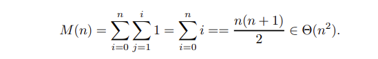

第3章 蛮力法

## 习题3.1
- a. 请举出不能作为蛮力法的一个算法

  欧几里得算法(辗转相除法) 

  b. 请举出不能用蛮力法解决的一个问题

  TSP旅行商问题，无法在多项式时间复杂度下完成求解

- a. 有一个计算a<sup>n</sup>的蛮力算法，请用n的函数来表示它的效率。如果用n的二进制位数的函数来表示呢？

  M(n)=n≈ 2<sup>b</sup>，其中M(n)是在计算a<sup>n</sup>时由蛮力算法进行的乘法次数，b是n的二进制表示中的位数。因此，效率与n呈线性关系，与b呈指数关系。

  b. 如果正在计算a<sup>n</sup> mod m，其中a>1, 并且n是一个大于0的大整数，如何才能处理好a<sup>n</sup>的巨大数量级问题？

  执行所有乘法算子对m的模

  a<sup>i</sup> mod m = (a<sup>i−1</sup> mod m · a mod m) mod m for i = 1, ..., n.

- 对于习题2.3中4，5，6题中的每一个算法，请指出它们是不是基于蛮力法

  Problem 4 : 蛮力法

  Problem 5 : 蛮力法

  Problem 6 : 蛮力法

- a. 设计一个蛮力算法，对于给定的x<sub>0</sub>,计算下列多项式的值：

  <center>p(x) = a<sub>n</sub>x<sup>n</sup> + a<sub>n-1</sub>x<sup>n-1</sup>+...+a<sub>1</sub>x<sup>1</sup>+a<sub>0</sub></center>

  并确定该算法的最差效率类型。

  以下是简单版本的伪代码：
  算法 BruteForcePolynomialEvaluation( P[0..n], x)
  //该算法计算给定点x处多项式P的值
  //通过 “从最高到最低项”的蛮力算法
  //输入：n次多项式系数的数组P[0..n]，
  //从最低到最高和数字x存储
  //输出：点x处多项式的值

  ```c++
  p←0
  for i←n，downto 0 do
        power←1
        for j←1 to i do
              power←power*x
        p←p+p[i]*power
  return p
  ```

  将通过多项式的次数n来测量输入的大小。该算法的基本操作是两个数字的乘法；这个
  乘法次数M（n）仅取决于多项式的次数。计算算法的最内部循环，用于查找算法的效率类：

  

  b. 如果你设计的算法属于O(n<sup>2</sup>), 请为该问题设计一个线性的算法。

  

  算法BetterBruteForcePolynomialEvaluation（P[0..n]，x）

  //该算法计算给定点x处多项式P的值

  //通过“最低到最高项”算法

  //输入：n次多项式系数的数组P[0..n]，

  //从最低到最高，数字x

  //输出：点x处多项式的值

  ```c++
  p←p[0]；power←1
  
  for i←1 to n do
  
  power←power*x
  
  p←p+p[i]*power
  
  return p
  ```

  乘法计算次数：

  

​       c. 如对于该问题，能否设计一个比线性效率更好的算法。

​         不能，因为任何计算多项式的算法，都必须至少计算n个加法

-   设网络拓扑图可以展示计算机、打印机和其他设备之间如何通过网络进行连接，以下为三种常见的网络拓扑结构：环形拓扑、星形拓扑和完全互联拓扑。

  

  现在给出一个布尔矩阵A[0...n-1,0...n-1]，其中n>3，它用邻接矩阵来表示上述拓扑结构所对应的图。能否确定邻接矩阵表示的是哪一种拓扑结构？设计一种蛮力算法来解决这个问题并指出它的时间效率类型。

  ```c++
  bool judge1(int A[][],int n) //判断是否为环
  {
      for(int i =0;i<n;i++)
      {
          int count = 0;
          for(int j=0;j<n;j++)
            if(A[i][j]==1)
            {
              count +=1;
            }
          if(count!=3)
          return false;
      }
      return true;
  }
  
  bool judge2(int A[][],int n) //判断是否为星型
  {
      for(int i=0;i<n;i++) //依次判断其中一个节点是否为中间点
      {
          bool flag = true;
          for(int j=0;j!=i,j<n;j++)
          {
              if(A[i][j]!=1 || judge_only_one(j)==false) //没有互相连接 或者 其他节点存在与i之外的节点连接
              {
                  flag = false;
                  break;
              }
  
  
          }
          if(flag)
             return true;
          
      }
      return false;
  }
  
  
  bool judge3(int A[][],int n) //判断是否为完全互连
  {
      for(int i =0;i<n;i++)
      {
          bool flag = true;
          for(int j=0;j<n;j++)
            if(A[i][j]!=1)
            {
              return false;
            }
      }
      return true;
  }
  ```

- 使用选择排序将序列E,X,A,M,P,L,E按照字母顺序排序

  | **\|E** | X    | A    | M    | P    | L    | E    |
  | ------- | ---- | ---- | ---- | ---- | ---- | ---- |
  | A       | \|X  | E    | M    | P    | L    | E    |
  | A       | E    | \|X  | M    | P    | L    | E    |
  | A       | E    | E    | \|M  | P    | L    | X    |
  | A       | E    | E    | L    | \|P  | M    | X    |
  | A       | E    | E    | L    | M    | \|P  | X    |
  | A       | E    | E    | L    | M    | P    | \|X  |

- 选择排序稳定吗？

  选择排序不稳定，因为它可能会交换那些相等的元素

- 如果对链表实现选择排序，能不能获得和数组版相同的O(n<sup>2</sup>)效率？

  可以，因为链表同样可以采取相同复杂度的操作

- 采取冒泡排序将序列E,X,A,M,P,L,E按照字母顺序排序


- a.请证明，如果冒泡排序对列表比较一遍之后没有交换元素的位置，那么这个表已经排序好了，算法也停止了。

  如果不存在元素交换，那么一定会有：

  <center> A<sub>0</sub> < A<sub>1</sub><...A<sub>n-1</sub> < A<sub>n</sub></center>

  b.结合所做的改进，为冒泡排序写一段伪代码

```c++
count ← n − 1 //number of adjacent pairs to be compared
sflag ← true //swap flag
while sflag do
      sflag ← false
      for j ← 0 to count−1 do
          if A[j + 1] < A[j]
             swap A[j] and A[j + 1]
             sflag ← true
      count ← count −1
```

- 交替放置的碟子，有数量为2n的一排碟子，n黑n白交替放置：黑、白、黑、白.....现在要把黑碟子都放在右边，白碟子全部放在左边，只允许交换相邻碟子的位置来实现，请编写对应算法，并确定该算法需要执行的交换次数。

  采取类似于冒泡排序的思想，一旦遇到相邻两个元素，其中左边为1(黑)，右边为0(白)，那么进行交换为01,依次到末尾，这样的一次操作，可以将一个黑球移动到右侧序列，这样的操作一共需要n次，有关代码如下：

  ```c++
  
  void func(int arr[],int n)
  {
      for(int i=0;i<n;;i++)  //总共存在n个黑球
      {
          for(int j=0;j<2n-1;j++) //一次操作需要依次判断2n-1个序列对
          {
              if(arr[j]==1 && arr[j+1]==0)
              {
                  swap(arr[j],arr[j+1]);
              }
          }
      }
  }
  ```

  所需的交换次数与初始状态有关

  若初始状态黑球全在右边，那么无需进行交换

  若初始状态黑球全在左边，那么一共需要交换n<sup>2</sup>次


&emsp;
