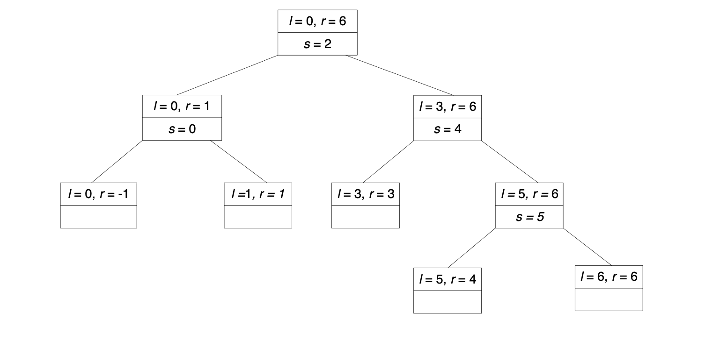

# 习题5.2

1. 应用快速排序将序列E，X，A，M，P，L，E按照字母顺序排序，并画出相应的递归调用树。

   **解答**：

   **python代码**

   ```python
   def Quicksort(A,l,r):
       if l<r:
           s = HoarePartition(A,l,r)
           Quicksort(A,l,s-1)
           Quicksort(A,s+1,r)
   
   def HoarePartition(A,l,r):
       p = A[l]
       i = l+1
       j = r
       while i < j:
           while i < r and A[i] < p:
               i += 1
           while A[j] > p:
               j -= 1
           A[i],A[j] = A[j],A[i]
       A[i],A[j] = A[j],A[i]
       if A[l] > A[j]:
           A[l],A[j] = A[j],A[l]
       return j
     
   #test
   t = np.array(['E','X','A','M','P','L','E'])
   Quicksort(t,0,len(t)-1)
   t
   ```

   **递归调用树**如图5.2-1所示。

   

   **图5.2-11** 递归调用树

   

2. 对于本节描述的划分过程：

   a. 请证明，如果两个扫描指针停下来以后指向的是同一个元素，也就是说$i=j$，那么，该元素的值一定等于$p$。

   b. 请证明，当扫描指针停下来时，$j$指向的元素位置只可能比$i$指向的元素位置左移一格，而不可能左移更多。

   **解答**：a. 因为停止扫描的条件是$A[i]\geq p,A[j]\leq p$，因此当$i=j$时，$A[i]=A[j]=p$。

   ​            b. 因为扫描是在$i<j$情况加进行的，所以最多就是$i$不移，$j$前移一格，因此最多只可能左移一格。

   

3. 举例并说明快速排序不是一个稳定的排序算法。

   **解答**：当两个元素相等时，快速排序会交换其位置，因此不是一个稳定算法。

   

4. 请举一个$n$个元素数组的例子，使得我们有必要对它使用本节提到的“限位器”。限位器的值应该是多少？在解释一下，为什么一格限位器能满足所有的输入。

   **解答**：因为参考值是一最左侧元素，因此当最左侧元素大于其余所有元素时，$i+1$是有可能超过$n$，因此需要加一个$n-1$的限位器。

   

5. 对于本节给出的快速排序版本：

   a. 一个所有元素都相等的数组，是该算法的最差输入还是最优输入，或者均不是？

   b. 一个严格递减的数组，是该算法的最差输入还是最优输入，或者均不是？

   **解答**：a. 属于最优输入，因为所有的划分点均在中间

   ​            b. 属于最差输入，因为分裂点均在极端，子数组一个为空，另一个为$n-1$。

   

6. 若采用三平均轴选择法：

   a. 一个递增数组，是该算法的最差输入还是最优输入，或者均不是？

   b. 一个递减数组，是该算法的最差输入还是最优输入，或者均不是？

   **解答**：a、b均属于最优输入，因为对于单调数组，最左端元素、最右端元素、最中间元素中的中位数为最中间元素，因此划分点均在中间。

   

7. a. 对于一个包含100万随机数的数组排序，快速排序比插入排序快多少倍？ 

   b. 对于$n>1$的$n$元素数组，是否存在插入排序比快速排序更快的情形？

   **解答**：

   a. 当$n=1000000$时，

   ​    $$\frac{C_{inset}}{C_{fast}}\approx \frac{n^2/4}{1.39n\log_2n}=9023$$

   b. 存在，当输入序列为递增序列时，插入排序快于快速排序。

   

8. 设计一个算法对$n$个实数组成的数组进行重新排序，使得其中所有负元素都位于正元素前，该算法兼顾空间效率与时间效率。

   **解答**：

   **思路**：该算法思路类似快速排序，需要左右两个指针开始扫描。扫描过程判断左指针元素和0的大小，小于0，左指针右移；否则交换左指针右指针元素，右指针左移。

   **python代码**

   ```python
   def NegBeforePos(A):
       AA = A.copy()
       i = 0
       j = len(AA)-1
       while i < j:
           if AA[i] < 0:
               i += 1
           else:
               AA[i],AA[j] = AA[j],AA[i]
               j -= 1
       return AA
   
   #test
   t = np.array([-1,2,-3,5,-7])
   NegBeforePos(t)
   ```

   

9. a. 荷兰国旗问题要求对字符R、W和B构成的任意数组排序，使得所有R排在最前面，W随后，B在最后。为该问题设计一个效率为线性的在位算法。

   b. 解释如何将快速排序算法应用于解决荷兰国旗问题。

   **解答**：

   **思路**：该算法思路和第8题类似，只不过第8题中之需要分出负数和正数两类，此问题需要分出R、W、B三类，需要r、w、b三个指针进行扫描。r、w指针均从左侧开始，b指针从右侧开始。扫描过程判断w指针元素:

   - 若$A[w]=R$，交换$A[r]、A[w]$，$r++,w++$
   - 若$A[w]=W$，$w++$
   - 若$A[w]=B$，交换$A[w]、A[b]$，$b--$

   **python代码**

   ```python
   def DNFP(A):
       AA = A.copy()
       r = 0
       w = 0
       b = len(AA)-1
       while w < b:
           if AA[w] == 'R':
               AA[r],AA[w] = AA[w],AA[r]
               r += 1
               w += 1
               
           elif AA[w] == 'W':
               w += 1
           else:
               AA[w],AA[b] = AA[b],AA[w]
               b -= 1
       return AA
   
   #test
   t = np.array(['B','R','B','W','B','R'])
   DNFP(t)
   ```

   

10. 任选一种语言实现快速排序算法。用该程序处理一批输入样本，检验该算法的理论效率的正确性。

    **解答**：代码详见习题5.2.1

    

11. 螺钉螺母问题。假设我们有$n$个直径各不同的螺钉以及相应的螺母。一次只能比较一对螺钉螺母判断是否适合。然而，不能拿两个螺母或者两个螺钉进行比较。问题要找到每一对配对的螺钉和螺母。设计一个算法，使得平均效率必须属于集合$\Theta(n\log n)$。

    **解答**：

    **思路**：快速排序法的平均速率就属于$\Theta(n\log n)$。螺钉螺母问题可以将螺母尺寸、螺钉尺寸当作比较值分别交叉对螺钉、螺母进行快速排序。具体步骤为：

    - **step1**：选取第一个螺母尺寸作为比较值，将螺钉分为小于该值集合A1、大于该值集合A2，并获得匹配成功螺钉位置
    - **step2**：根据**step1**中获得的匹配螺钉值对螺母进行划分，获得小于该值集合B1、大于该值集合B2
    - **step3**：将分别对A1、B1以及A2、B2重复上述步骤

    **python代码**

    ```python
    def NutsBolts(N,B,l,r):
        if l<r:
            temp = Partition(B,l,r,N[l])
            Partition(N,l,r,B[temp])
            NutsBolts(N,B,l,temp-1)
            NutsBolts(N,B,temp+1,r)
    
    def Partition(A,l,r,p):
        i = l
        j = r
        while i < j:
            while i < r and A[i] < p:
                i += 1
            while A[j] > p:
                j -= 1
            A[i],A[j] = A[j],A[i]
        A[i],A[j] = A[j],A[i]
        if A[l] > A[j]:
            A[l],A[j] = A[j],A[l]
        return i
    
    # test
    t = np.array([1,2,3,4,5])
    Nuts = np.random.permutation(t)
    Bolts = np.random.permutation(t)
    print('Original Nuts:',Nuts,'Original Bolts:',Bolts)
    NutsBolts(Nuts,Bolts,0,len(Nuts)-1)
    print('Ordered Nuts:',Nuts,'Ordered Bolts:',Bolts)
    ```

    